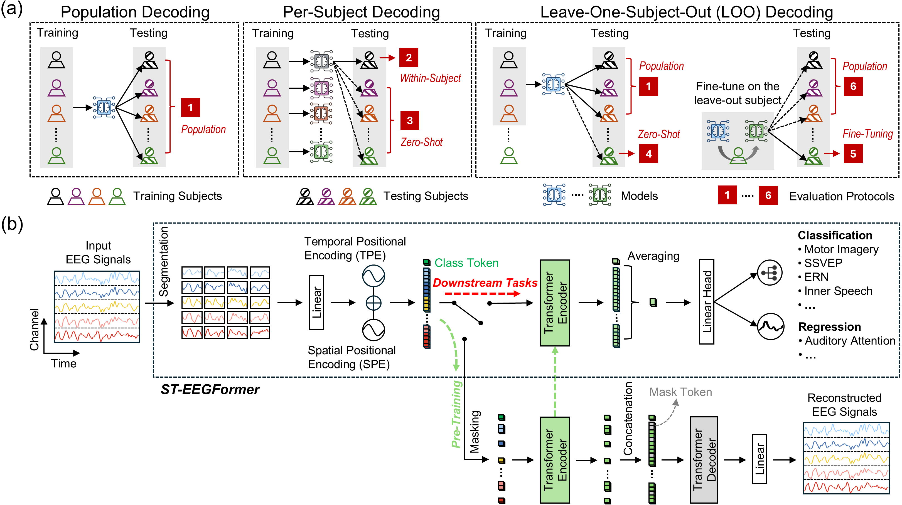

# ST-EEGFormer
<p align="center">
  
</p>


*A fair EEG-BCI benchmark framework and a simple yet powerful ST-EEGFormer foundation model.*

**Authors:**  
Liuyin Yang ([liuyin.yang@kuleuven.be](mailto:liuyin.yang@kuleuven.be))  
Qiang Sun ([qiang.sun@kuleuven.be](mailto:qiang.sun@kuleuven.be))  
Ang Li ([ang_lii@outlook.com](mailto:ang_lii@outlook.com))  
Marc Van Hulle ([marc.vanhulle@kuleuven.be](mailto:marc.vanhulle@kuleuven.be))  

All rights reserved.

---

## 1. Environment

The models are implemented in **PyTorch** and can be used in standard Python environments.

> **Python version used for pre-training:** `3.11.5`

### 1.1 Core Dependencies (for loading & using the model)

| Package | Version | Note                                            |
|---------|:-------:|-------------------------------------------------|
| `timm`  | 1.0.10  | Basic implementations of transformer models     |
| `torch` | 2.4.1   | Deep learning framework                         |

### 1.2 Extra Dependencies (for training foundation & neural models)

| Package        | Version | Note                                      |
|----------------|:-------:|-------------------------------------------|
| `wandb`        | 0.22.2  | Training monitoring & experiment logging  |
| `mat73`        | 0.65    | Loading MATLAB v7.3 `.mat` data files     |
| `scikit-learn` | 1.3.2   | Evaluation metrics and utilities          |

### 1.3 Classic EEG Model Dependencies

If you want to run the training code for **classic EEG models**, you will also need:

| Package     | Version | Note                                           |
|-------------|:-------:|------------------------------------------------|
| `mne`       | 0.22.2  | EEG preprocessing and data handling            |
| `pyriemann` | 0.3     | Riemannian geometry-based EEG classification   |
| `lightgbm`  | 3.3.0   | Gradient boosting models for tabular features  |
| `meegkit`   | 0.1.0   | EEG/MEG signal processing utilities           |
| `scipy`     | 1.11.4  | General scientific computing utilities        |

---

## 2. Model Specs

**ST-EEGFormer** is designed for **128 Hz EEG data**.

- Pre-trained to reconstruct **6-second EEG segments**  
- Supports up to **145 EEG channels**  
- Recommended input: **≤ 6-second segments**, sampled at **128 Hz**

The list of available/pretrained channels can be found in:

```text
pretrain/senloc_file
```

## 3. Quick Start

A Jupyter notebook containing a minimal tutorial on how to use the model can be found in:

```text
easy_start/simple_example.ipynb
