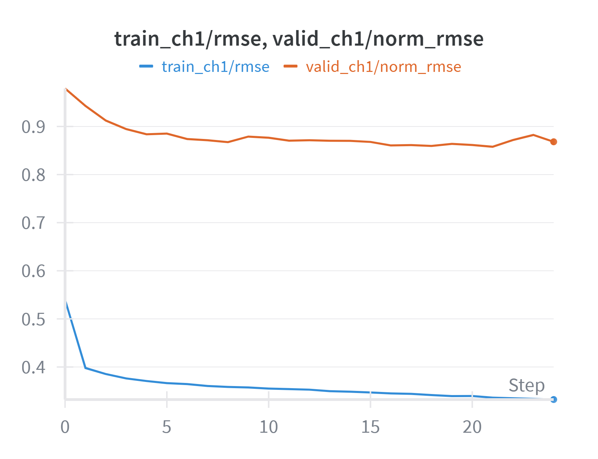

# ST-EEGFormer for 2025 EEG Foundation Challenge 1

---

## 1. Environment

The models are implemented in **PyTorch** and can be used in standard Python environments.

> **Python version used for pre-training:** `3.11.5`

### 1.1 Core Dependencies (for loading & using the model)

| Package | Version | Note                                         |
|---------|:-------:|----------------------------------------------|
| `timm`  | 1.0.10  | Basic implementations of transformer models |
| `torch` | 2.4.1   | Deep learning framework                      |

### 1.2 Extra Dependencies (for training the model)

| Package        | Version | Note                                      |
|----------------|:-------:|-------------------------------------------|
| `wandb`        | 0.22.2  | Training monitoring & experiment logging  |
| `mat73`        | 0.65    | Loading MATLAB v7.3 `.mat` data files     |
| `peft`         | 0.17.1  | LoRA fine-tuning                          |
| `eegdash`      | 0.4.1   | Loading the competition datasets          |

---

## 2. Model Specs

**ST-EEGFormer** is designed for **128 Hz EEG data**.

- In this folder, you will find a variant model (`utils/models_vit_eeg.py`) that **upsamples** the input EEG data from **100 Hz to 128 Hz**, since the competition data is sampled at 100 Hz.  
- The **channel indices** are directly hard-coded in the model definition file.

---

## 3. Reproducibility

If you want to **train the model**, use the script:

```text
eeg_foundation_2025/ddp_finetune_eeg.py
```

We provide the following training setup, which in our experiments achieved a local validation normalized RMSE below 0.9.

Hardware: 2× NVIDIA H100 80 GB GPUs

Training time: ~4h 30min for 25 epochs (converged by the end)

Example command:

```python
python eeg_foundation_2025/ddp_finetune_eeg.py \
  --challenge challenge1 \
  --model vit_large_patch16 \
  --output_dir /challenge1 \
  --device cuda \
  --batch_size 64 \
  --accum_iter 2 \
  --num_workers 4 \
  --epochs 51 \
  --warmup_epochs 2 \
  --lr 0.0003 \
  --min_lr 0.00003 \
  --head_method avg \
  --vit_pretrained_model_dir /checkpoint-210.pth \
  --use_lora \
  --lora_r 4 \
  --lora_last_n 8 \
  --lora_dropout 0.2 \
  --lora_alpha 16 \
  --lora_lr_scale 1.5
```

You will need the following pre-trained model to reproduce this experiment:

[ST-EEGFormer-large release-HBN](https://github.com/LiuyinYang1101/STEEGFormer/releases/tag/ST-EEGFormer-largeV2).

Below is the corresponding learning curve.

<p align="center">
  
</p>